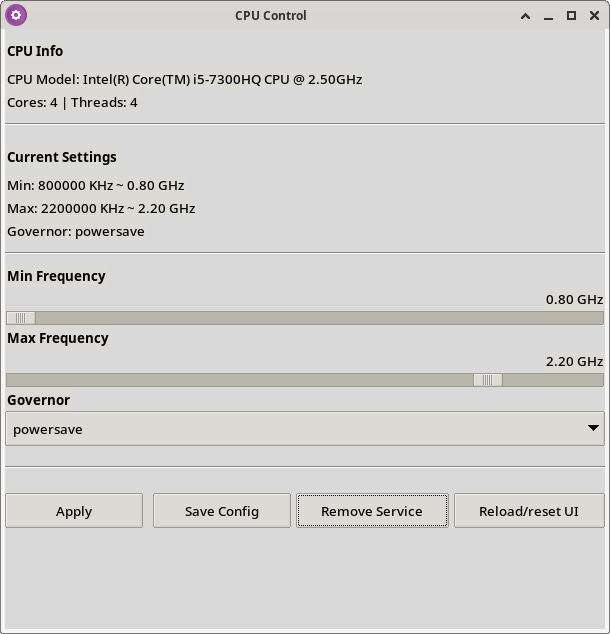

# CPU Control

Personal GUI application to adjust minimum/maximum CPU frequency and governor on
Linux. Tested on Debian 13 xfce and Xubuntu.



## Requirements

- Python 3
- tkinter
- polkitd (pkexec)
- Permissions to write to `/sys/devices/system/cpu`

## Run in development

```bash
python3 -m cpu_control.main
```

## Install

Go to the [Releases section](https://github.com/ArnoldWW/cpu-control/releases),
download and install.

## Manual Installation

Run `sudo ./build-deb.sh` and install the generated .deb file with
`sudo apt install ./xxx.deb`.

## Features

- Adjust minimum and maximum frequency
- Select governor
- Save configuration and create systemd service
